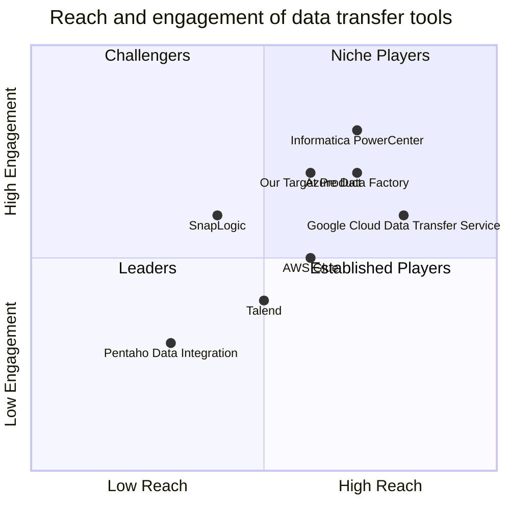

## Original Requirements:

The boss wants to create a tool that can use APIs from Google BigQuery and move data to an Azure database.

## Product Goals:
```python
[
    "Create a tool that integrates with Google BigQuery APIs",
    "Enable data transfer from Google BigQuery to Azure database",
    "Ensure efficient and reliable data transfer"
]
```

## User Stories:
```python
[
    "As a data analyst, I want to be able to easily connect to Google BigQuery and transfer data to Azure database",
    "As a data engineer, I want to have control over the data transfer process and ensure its reliability",
    "As a business user, I want to be able to schedule regular data transfers from Google BigQuery to Azure database",
    "As a developer, I want to have access to a well-documented API for integrating with Google BigQuery and Azure database",
    "As a system administrator, I want to be able to monitor and troubleshoot data transfer issues"
]
```

## Competitive Analysis:
```python
[
    "Google Cloud Data Transfer Service: Provides a managed service for transferring data between Google Cloud services",
    "Azure Data Factory: Offers data integration and orchestration service for moving data between various sources and destinations",
    "AWS Glue: Provides a fully managed extract, transform, and load (ETL) service for data integration",
    "Talend: Offers a comprehensive data integration platform with support for various data sources and destinations",
    "Informatica PowerCenter: Provides enterprise data integration and management software",
    "SnapLogic: Offers a cloud-based integration platform for connecting data sources and applications",
    "Pentaho Data Integration: Provides an open-source data integration platform with support for various data sources and destinations"
]
```

## Competitive Quadrant Chart:


## Requirement Analysis:
The product should be a tool that integrates with Google BigQuery APIs and allows users to transfer data from Google BigQuery to an Azure database. It should provide efficient and reliable data transfer capabilities, with options for scheduling regular transfers and monitoring transfer status. The tool should have a well-documented API for developers to integrate with and should support various data types and formats. It should also have robust error handling and logging mechanisms to ensure data integrity.

## Requirement Pool:
```python
[
    ("Support for large datasets", "P0"),
    ("Ability to transform data during transfer", "P1"),
    ("Support for incremental data transfer", "P1"),
    ("Integration with Azure Active Directory for authentication", "P2"),
    ("Ability to schedule transfers at specific intervals", "P2")
]
```

## UI Design draft:
The tool should have a user-friendly interface with the following elements and functions:
- Login screen: Users can enter their credentials to connect to Google BigQuery and Azure database.
- Dashboard: Provides an overview of the data transfer status, including the number of successful transfers, failed transfers, and transfer progress.
- Transfer settings: Allows users to configure the source and destination details, such as Google BigQuery dataset, Azure database connection string, and transfer frequency.
- Transfer history: Displays a log of past data transfers, including the transfer start time, end time, and status.
- Error handling: Provides clear error messages and suggestions for troubleshooting data transfer issues.
- Notifications: Sends email notifications to users when data transfers fail or encounter issues.

The UI should have a clean and modern design, with a responsive layout that adapts to different screen sizes. It should use intuitive icons and labels to guide users through the data transfer process.

## Anything UNCLEAR:
There are no unclear points.