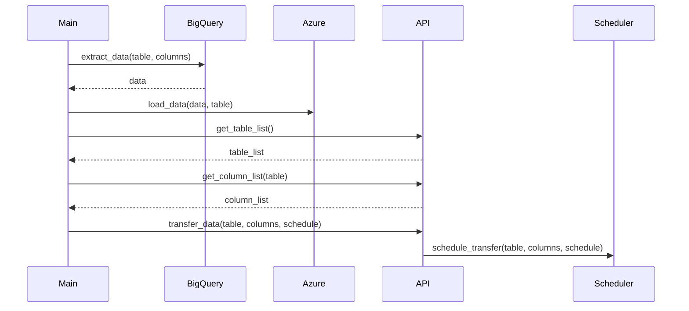

## Implementation approach:
To efficiently transfer data from Google BigQuery to Azure database and ensure alignment with GA4, Google Search Console, and Google Ads data, we will use the following open-source tools:

1. **Apache Airflow**: Airflow is a platform to programmatically author, schedule, and monitor workflows. We can use it to schedule and automate the data transfer process.

2. **Google Cloud SDK**: The Google Cloud SDK provides command-line tools and libraries for interacting with Google Cloud services, including BigQuery. We can use it to extract data from BigQuery.

3. **Azure SDK for Python**: The Azure SDK for Python provides libraries for interacting with Azure services, including the Azure database. We can use it to load data into the Azure database.

4. **FastAPI**: FastAPI is a modern, fast (high-performance), web framework for building APIs with Python 3.7+ based on standard Python type hints. We can use it to create a user-friendly API for easy configuration and monitoring of the data transfer process.

## Python package name:
```python
"bigquery_to_azure"
```

## File list:
```python
[
    "main.py",
    "config.py",
    "bigquery.py",
    "azure.py",
    "api.py",
    "scheduler.py"
]
```

## Data structures and interface definitions:
```mermaid
classDiagram
    class BigQuery:
        +extract_data(table: str, columns: List[str]) -> pd.DataFrame
    class Azure:
        +load_data(data: pd.DataFrame, table: str)
    class API:
        +get_table_list() -> List[str]
        +get_column_list(table: str) -> List[str]
        +transfer_data(table: str, columns: List[str], schedule: str)
    class Scheduler:
        +schedule_transfer(table: str, columns: List[str], schedule: str)
```

## Program call flow:


## Anything UNCLEAR:
The requirements are clear.