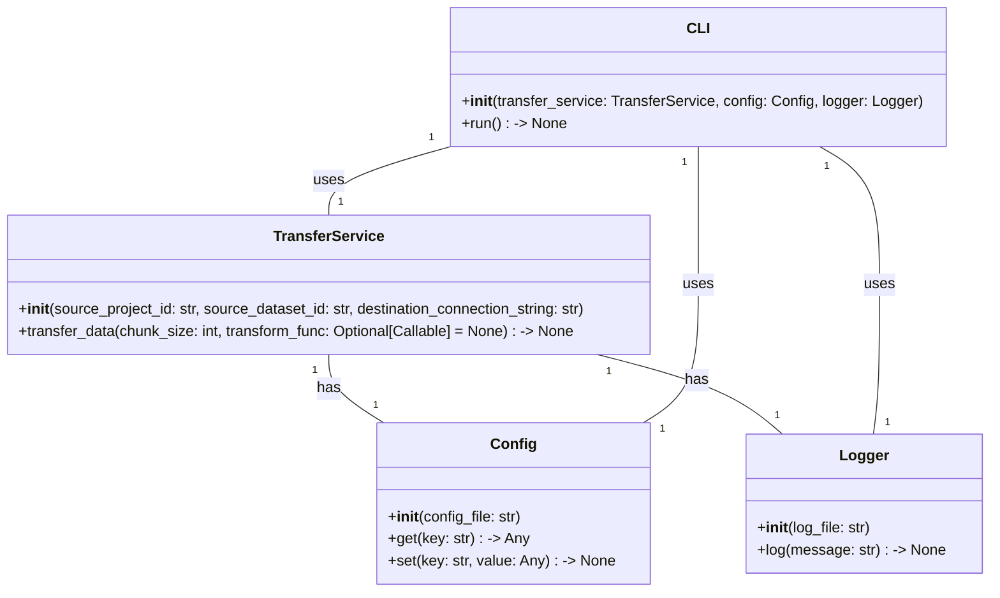
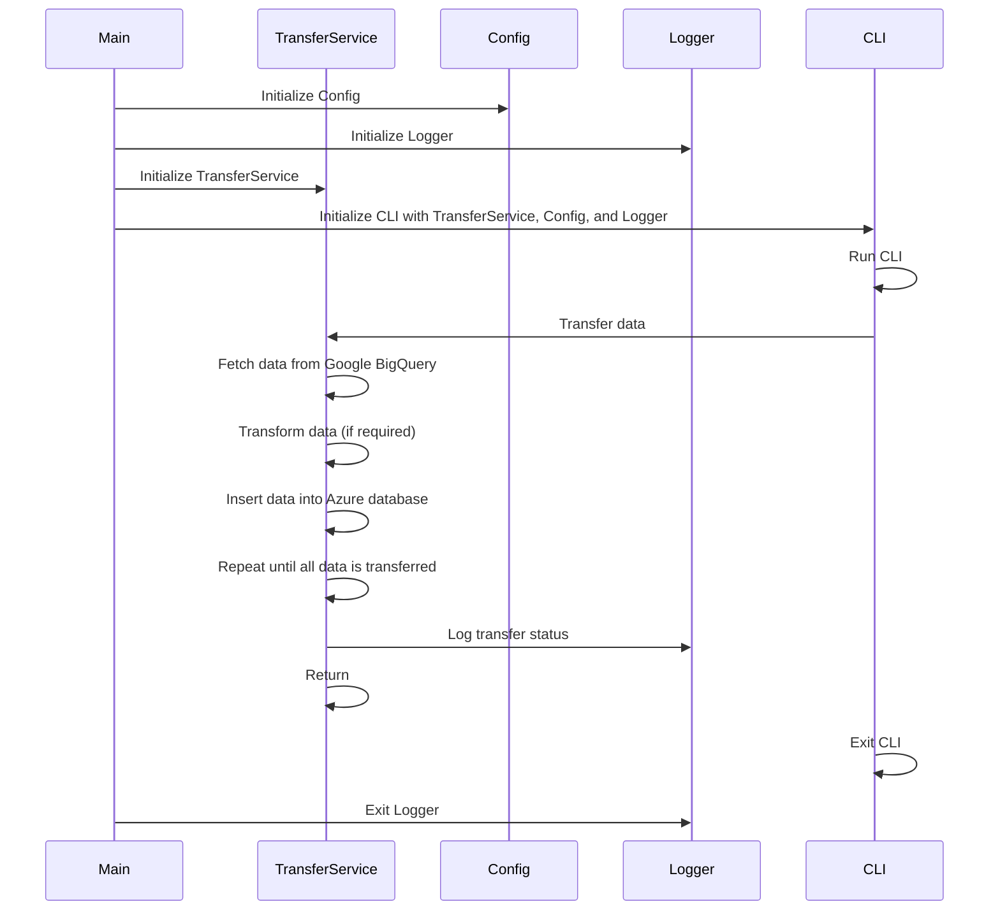

## Implementation approach:
To implement the tool that integrates with Google BigQuery APIs and transfers data to an Azure database, we will use the following approach:

1. Use the `google-cloud-bigquery` library to connect to Google BigQuery and retrieve data.
2. Use the `pyodbc` library to connect to the Azure database and insert data.
3. Implement a data transfer service that fetches data from Google BigQuery in chunks, transforms it if required, and inserts it into the Azure database.
4. Use the `schedule` library to schedule regular data transfers at specific intervals.
5. Implement error handling and logging mechanisms to ensure data integrity and provide troubleshooting information.
6. Design a user-friendly command-line interface (CLI) for users to interact with the tool and configure transfer settings.

## Python package name:
```python
"bigquery_to_azure"
```

## File list:
```python
[
    "main.py",
    "transfer_service.py",
    "config.py",
    "logger.py",
    "cli.py"
]
```

## Data structures and interface definitions:


## Program call flow:


## Anything UNCLEAR:
The requirements are clear to me.